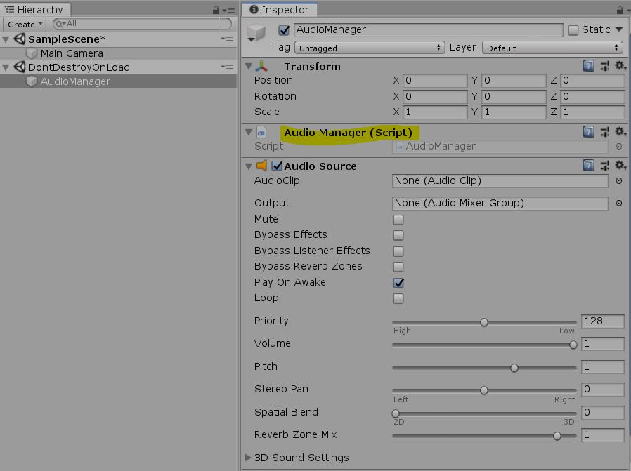

# unity-audio-manager

This is audio manageer sample for Unity.

## Usage

You can play the sound very easily:

```c#
public class AudioTest : MonoBehaviour
{
    [SerializeField]
    private AudioClip TestClip;
    
    void Update()
    {
        if (Input.GetKeyDown(KeyCode.Alpha0))
            AudioManager.GetInstance().PlayOneShot(TestClip);
    }
}
```


